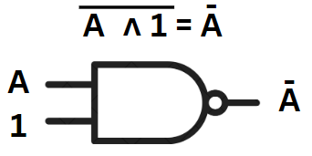
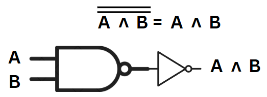
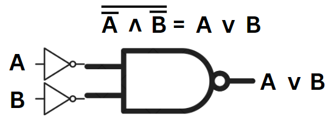
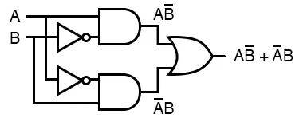
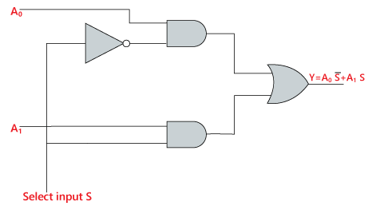
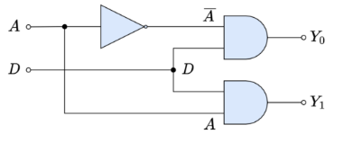

# ArquiTech [Equipo 1]
## Integrantes
- **Yeison Adrian Caceres Torres** - [https://adrianccrs.github.io/ArquiTech/index.html#adrian]
- **Daniel Sebastian Badillo Neira** - [https://adrianccrs.github.io/ArquiTech/index.html#sebastian]
- **Leider Joanny Esteban Lozano** - [https://adrianccrs.github.io/ArquiTech/index.html#leider]
- **Andres Felipe Avella Rubiano** - [https://adrianccrs.github.io/ArquiTech/index.html#andres]

# Pácticas

## Práctica 01: Conociendo nustros compañeros e instalando y reconociendo las principales características de Nand2Tetris

### Descripción
El objetivo de la primera parte de la práctica es conocernos con nuestros compañeros de grupo y entre todos realizar la publicación de un sitio web en donde nos presentemos a nosotros y a las prácticas. Luego en la segunda parte realizamos el proyecto 01 de _nand2tetris_, en el cual a partir del funcionamiento de una compuerta nand creamos otras compuertas lógicas básicas como las _AND, NOT, OR_ para uno, o 16 bits; además de el funcionamiento de multiplexores y demultiplexores a partir de estas compuertas.

## Preguntas de la práctica
**1.** ¿Que consideraciones importantes debe tener en cuenta para trabajar con Nand2Tetris?
**Rta:** Es importante contar con conocimientos previos acerca de la lógica digital, las funciones lógicas y el cómo combinarlas para sacar unas de otras usando el álgebra booleana y conceptos de circuitos digitales. Tambien se debe tener noción de lo que es un Multiplexor y un Demultiplexor, y conocimiento básico de números binarios.

**2.** ¿Qué otras herramientas similares a Nand2Tetris existen? (De mínimo dos ejemplos)
**Rta:** NandGames (https://nandgame.com) y logisim (https://es.wikipedia.org/wiki/Logisim)

## Compuertas realizadas
- `Not.hdl`: Para realizar la compuerta not a partir de una _nand_ simplemente hay que hacer que una de las entradas de sea siempre 1 (o **true**), por lo que la salida de la compuerta será la negación de la entrada, así:

- `And.hdl`: Para la compuerta _and_ es tan sencillo como utilizar la compuerta _nand_ y luego negarla.

- `Or.hdl`: Para poder hacer la compuerta _or_ lo que hicimos fue negar las entradas de la compuerta _nand_, de esta manera nos aseguramos de que la única forma de que la salida sea 0 o _false_ es ambas entradas sean 0 o _false_, ya que las negará, entrará 1 y 1, por tanto la salida será 0; así:

-`Xor.hdl`: Para la compuerta _xor_ (or exclusivo) nos vamos directamenta a su construccion con compuertas lógicas básicas, en donde utilizamos dos compuertas _and_ donde los inputs son alguno de los inputs iniciales y la negación del otro; luego, las salidas de esas compuertas _and_ entran a una _or_ y la salida de esa, es nuestra salida final, así:

-`Mux.hdl`: Para el multiplexor **(2 a 1)**, también nos vamos hacia su definición, en donde usamos dos compuertas _and_ y una _not_ que servirá para negar el selector, lo conectamos de la siguiente manera:

-`DMux.hdl`: Para el demultiplexor **(1 a 2)** usamos tambien dos compuertas _and_ y una _not_ pero de maneras distintas, pues ya no se usa el _not_ en el selector sino en el input, así:

- `Not16.hdl, And16.hdl, Or16.hdl, Mux16.hdl`: Estas son las mismas compuertas pero para inputs de 16 bits, por lo que lo unico que hay que hacer es aplicar cada compuerta a cada uno de los 16 bits de ambos inputs y ya obtenemos el resultado correcto.

-`Or8Way.hdl`: Para esta compuerta tenemos que aplicar la compuerta _or_ entre los 8 bits de un numero, osea, aplicamos como entradas de la _or_ un bit y su vecino siguiente, lo que nos arroje esa la ingresamos a una nueva compuerta _or_ junto con el siguiente bit y así suscesivamente. Algo así como un _or_ entre los bits **(8 en este caso)**.

-`Mux4Way16.hdl`: Ahora lo que nos piden es un multiplexor de **4 a 1** donde las entradas son de 16 bits (a,b,c,d). Afortunadamente ya creamos la compuerta `Mux16` por lo que queda más sencillo. Utilizamos la compuerta `Mux16` con el primer bit del selector, para reducir las posibilidades de salida a 2 (la salida entra a y b, y la salida entre c y d). Luego con el bit de selector que queda escogemos entre esas dos salidas anteriores y esa será nuestra salida final

-`Mux8Way16.hdl`: Proceso similar ya que nos piden un multiplexor **8 a 1**, cogemos las 8 entradas (a,b,c,d,e,f,g,h) y utilizamos la compuerta que creamos anteriormente; cogemos los dos bits menos significativos para el selector y partimos en 4 entradas usando dos compuertas `Mux4Way16`, esto hará que de todas esas entradas escoja solo una dependiendo del valor de los bits escogidos del selector. Luego, esas dos salidas las ingresamos a una compuerta `Mux16` usando el bit más significativo del selector restante, la salida recibida será nuestra salida final.

- `DMux4Way`: Nos piden un demultiplexor **1 a 4**, entonces acá usaremos las compuertas `DMux` creadas. La primera instancia de DMux divide la señal de entrada in en dos señales intermedias (ab y cd). Aquí, el bit más significativo (sel[1]) determina a cuál de los dos grupos se enviará la señal de entrada.
    - Si sel[1] = 0, la señal in se dirige al grupo ab.
    - Si sel[1] = 1, la señal in se dirige al grupo cd.
Luego, cada uno de los grupos (ab y cd) se subdivide usando el bit menos significativo (sel[0]). Este bit decide entre las salidas individuales dentro de cada grupo:
    - Para ab: Si sel[0] = 0, la señal va a a; si sel[0] = 1, va a b.
    - Para cd: Si sel[0] = 0, la señal va a c; si sel[0] = 1, va a d.

- `DMux8Way`: Ahora se nos pide un demultiplexor **1 a 8**, por suerte ya hicimos uno **4 a 1** y este proceso es parecido. Usamos los dos bits más significativos del selector y la compuerta anterior `DMux4Way` para decidir como dividir la señal original en 4 señales intermedias (ab, cd, ef, gh), tal cual como lo habíamos hecho antes. Por último cada una de esas señales intermedias pasa a una compuerta `Dmux` junto con el bit menos significativo para dividir los pares de salidas finales.