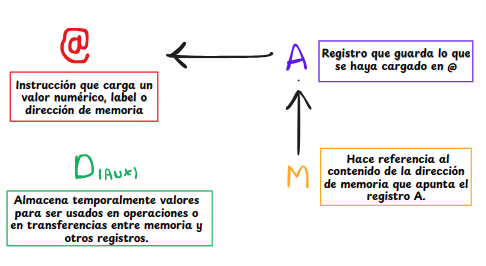

# Explicación del Proceso en los Códigos
# Descripción General

Este proyecto se centra en utilizar un nuevo lenguaje de bajo nivel similar a un _Assembly_ y se centra en hacer un pequeño bloque de instrucciones sencillo y transformarlo a binario, para poder ver ese proceso un poco más de cerca y comprobar que efectivamente cualquier código es transformado a lenguaje máquina (binario) con un traductor.
Se nos pide también el pensar las cosas desde lo más sencillo, pues el ejercicio de multiplicar R0 y R1 requiere que lo simplifiquemos.

Los principales módulos implementados incluyen:

- **Mult.asm**: Debemos multiplicar los valores almacenados en dos direcciones de memoria (R0 y R1) y almacenar el resultado en R2. Luego debemos traducirlo a instrucciones en binario y obtener un archivo llamado **Mult.hack** con ayuda del IDE web.
- **FullAdder.hdl**: Un sumador completo que maneja la suma de tres bits, incluyendo el acarreo.

## 1. Mult.asm
El problema que se nos plantea es mutiplicar los valores guardados en R0 y R1 y almacenar el resultado en R2.
Cuando utilizamos este lenguaje, solo podemos hacer tres tipos de operaciones:

- A-Instruction: Instrucciones de direccionamiento.
- C-Instruction: Instrucciones de computación.
- L-Instruction: Labels (Symbols) Instrucciones de declaración.

Entonces debemos arreglarnosla para pensar la multiplicación de otra manera; esencialmente cuando multiplicamos `a*b` estamos repetiendo el valor de `a`, `b` veces. Sería algo así como una sumatoria desde 0 hasta ``b`` de a.

Teniendo esto en mente, usaremos las operaciones que podemos utilizar de la siguiente manera:

1. Cargamos un valor inicial para R2:
```` Assembly
    (CARGA_R2)
        @R2 
        M=0
````
2. La idea es crear un loop, para expresar la multiplicación como una sumatoria, tal cual como lo propusimos anteriormente. Queremos multiplicar ``R0*R1``, así que lo que debemos hacer es sumarle ``R0`` a ``R2`` ``R1`` veces.
Entonces nuestro loop deberá ir de ``0`` a ``R1``, pero en este lenguaje los ciclos no se definen con límites como en otros lenguajes, así que lo que haremos será irle restando ``1`` a ``R1`` hasta que llegue a ``0``, esto significará que el bucle se ha repetido ``R1`` veces:

````Assembly
    (MULTI_LOOP)
        @R1
        D=M
        @END
        D;JLE

        @R0
        D=M
        @R2
        M=D+M

        @R1
        M=M-1

        @MULT_LOOP
        0;JMP  
````
En el código podemos ver que que se usa la etiqueta ``(MULT_LOOP)`` para el loop de la sumatoria que nos ayuda a hacer la multiplicación. Como se puede ver en la documentación, este bloque de código luego es accesible de nuevo a través de su etiqueta con la instrucción de direccionamiento.

> Cabe aclarar que en este lenguaje hay dos tipos de saltos (jumps), los condicionales y los incondicionales. Cuando hacemos la instrucción ``D;JLE`` estamos diciendo que solo hace el salto hacia la etiqueta ``(END)`` si el valor almacenado en ese momento en ``D`` es ``<=0``; en cambio cuando hacemos ``0;JMP`` estamos haciendo un loop infinito ya que no estamos evaluando ninguna condición sobre esa variable anterior para poder hacer el salto al bloque con esa etiqueta de nuevo, ya que nuestra variable de control del loop es ``R1>=0``.

Se deja el siguiente esquema en el cual se ilustra el cómo entendimos que funcionaba la lógica de este lenguaje:
<center>
  
</center>

---

## 2. Fill.asm
