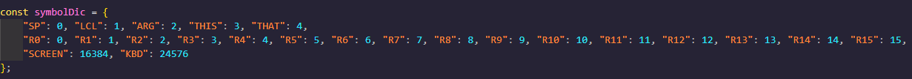
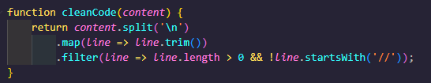
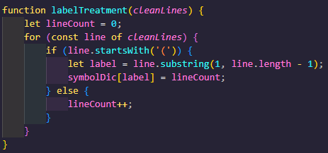
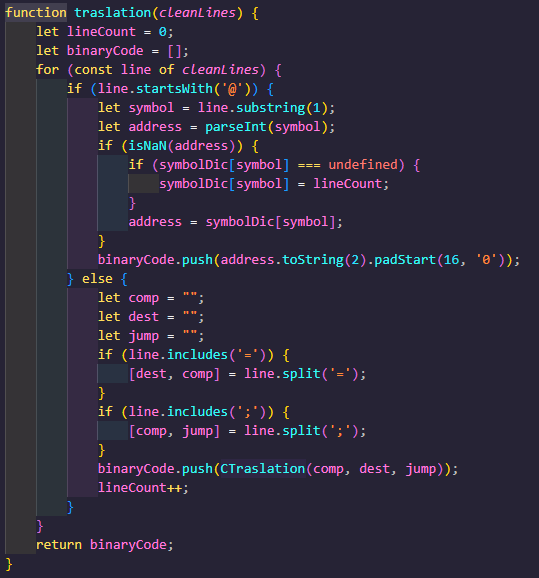

# Práctica 06: Implementación de un Traductor a Binario

En esta práctica, se implementó un traductor a binario para el ensamblador del proyecto Nand2Tetris. El objetivo principal fue desarrollar un programa que lea archivos de código ensamblador (.asm), los procese y genere el código binario correspondiente (.hack).

## Implementación en `assembler.js`

El archivo `assembler.js` contiene la lógica principal para leer, procesar y traducir el código ensamblador a binario. A continuación, se describen los pasos realizados:

### Lectura del Archivo

- Se utilizó un elemento `<input type="file">` en el HTML para permitir la carga de archivos `.asm`.
- Se añadió un evento `change` al input para leer el archivo seleccionado utilizando `FileReader`.

### Procesamiento del Código

- **Diccionario de símbolos**: Creamos un diccionario llamado `symbolDic`, en este, se almacenan los símbolos específicos del lenguaje ensamblador Hack y las direcciones de memoria correspondientes:

- **Limpieza del Código**: Se eliminan los espacios en blanco y los comentarios del código ensamblador.

- **Tratamiento de Etiquetas**: Se identifican y almacenan las etiquetas (labels), las cuales siempre van entre paréntesis, como por ejemplo (LOOP), en un diccionario de símbolos. Cabe aclarar que como estas instrucciones no ocupan espacio en memoria, no se debe aumentar el contador de línea.

- **Traducción de instrucciones C**: Traduce una instrucción de tipo C (cálculo, destino y salto) a partir de sus componentes (`comp`, `dest`, `jump`), dando como salida una instrucción binaria de 16 bits.

- **Traducción de Instrucciones**: Se tradujeron las instrucciones A y C a su representación binaria utilizando diccionarios de traducción.

- **Visualización de resultados**: Para ver el resultado se usó el propio HTML, modificando el DOM, para que sea cómodo para la persona que lo va a utilizar.

     Generación del Código Binario

    - Se generó el código binario correspondiente a cada instrucción y se almacenó en un array.
    - Se unieron las líneas de código binario en una cadena de texto para su visualización y descarga.

     Visualización y Descarga

    - Se mostró el código binario en un elemento `<pre>` dentro de la página HTML.
    - Se añadió un botón para descargar el archivo `.hack` generado.