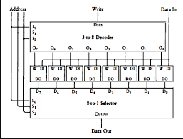
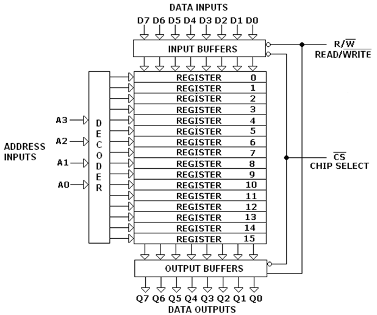

# Proyecto 03: Entendiendo y construyendo la memoria RAM

## Descripción
En este proyecto de _nand2tetris_ nos centramos en la construcción y el entendimiento de cómo funciona la memoria RAM, desde un simple y sencillo _register_ de 1 bit hasta una memoria de 16K bits. Tiene como objetivo al final también construir a partir de compuertas y multiplexores un contador de 16 bits con control de reseteo, carga de dato y registro. 

## Código de la práctica 

Cabe aclarar que para el proyecto se nos entrega hecho un _Data Flip Flop_ el cual utilizamos de aquí en adelante para ir fabricando otros componentes. Como cada proyecto, siempre que construimos algo, solemos utilizarlo para hacer el siguiente.

### Bit
El objetivo es fabricar un componente básico de almacenamiento como lo es el registro de 1 bit. Básicamente lleva un control _**'load'**_ que me dice si se guarda el valor o no, este mismo utiliza un Flip Flop para funcionar. Para construirlo usamos la siguiente lógica:
- Usamos un _multiplexor_ para hacer las selección de si guardar o no el bit dependiendo del parámetro `load`.
- Usamos el componente `DFF` para el Flip Flop
- Como no podemos usar el valor de salida `out` como parámetro de entrada, usamos una variable auxiliar `dff` para hacer de auxiliar y luego una compuerta `OR` consigo misma para dar la salida `out`.

### Register
Ahora nos toca armar un registro de 16 bits, por lo que solo repetimos el componente anterior para cada uno de los 16 bits del número que se nos entrega como parámetro y colocamos sus salidas en cada uno de los 16 bits del `out`. El parámetro `load` es el mismo para cada uno de los 16 componentes `Bit`.

### RAM8
Este componente ya se vuelve algo más complejo, pero su lógica es muy interesante de resolver, para ello visualicemos el siguiente gráfico:

Podemos visualizar que usamos un MUX y un DEMUX para poder darle dirección a los datos en la memoria, para poder elegir la posición en la que se va a guardar el dígito de 16 bits. Entonces ya sabemos que tenemos que usar los componentes creados en las prácticas anteriores: `DMux8Way` y `Mux8Way16`. 

El `DMux8Way`se va a encargar de dividir la señal del parámetro `load`en 8 canales independientes, y por medio del parámetro,`address`, el cual corresponde a un dígito de 3 bits, elegimos uno de esos 8 canales para transmitir la señal ingresada en `load`. Utilizamos un `register` para cada uno de los 8 canales, dándole por entrada de `load` los valores dados por el `DMux8Way` (ej: `la`, `lb`, `lc`, ..., `lh`); de esta manera se almacena en ese `register` el dígito que fue ingresado como `in`. 

Para dar como salida el valor que fue o no almacenado en alguno de los `register` utilizamos un `Mux8Way16`, el cual coge todos los 8 outputs (ej:`oa`, `ob`, `oc`, ..., `oh`) y según el mismo parámetro `address` nos muestra el valor que está siendo solicitado y este es dado en el `output`.

### RAM64

Acá lo que hacemos es exactamente la misma idea que con el componente anterior, solo que acá se nos da `address` como un dígito de 6 bits, por lo que debemos tener 64 direcciones de memoria. Entonces lo que hacemos es usar el componente `RAM8` que ya fabricamos para que cada una de las 8 direcciones por lo que tendríamos 8x8 direcciones (64). 

Lo que debemos hacer adicionalmente es particionar el dígito de `address` para que los tres bits más significativos sean ingresados en los MUX y DEMUX y los siguientes tres en los componentes de `RAM8`, de esta manera vamos a acceder a las direcciones jerárquicamente

### RAM512

Misma lógica que los anteriores, pero usamos el componente de `RAM64` y a como`address` tiene 9 bits, cogemos igualmente los tres bits más significativos para los MUX y DEMUX y el resto para el `RAM64`.

### RAM4K
Exactamente lo mismo, solo que usamos los componentes `RAM512`. Se usan igualmente los tres bits más significativos para los selectores y el resto en el componente

### RAM16K
La misma idea que con los anteriores, con diferencia de que cogemos un bit más para `RAM4K` cuando la usamos, ya que esta recibe un `address` de 12 bits y `RAM16K` recibe un `address` de 14 bits

### PC
Este componente es más complejo de realizar, porque debemos tener en cuenta muchas cosas, sobre todo con las salidas de los componentes que utilizamos para construirlo. Básicamente se trata de un _'counter'_de 16 bits, el cual puede cargar un número, incrementarlo en 1, o hacer un reset del número. Para ello se tienen las siguientes entradas de control: `reset`, `load`, `inc`.
Paso a paso lo que hacemos es lo siguiente:
- `Mux16(a= false, b=suma , sel=inc , out=outInc)`
	- Incrementamos el numero, y con un multiplexor seleccionamos 		dependiendo del valor de `inc` si cogemos ese valor, o un falso. 

- `Mux16(a= outInc, b=in , sel=load , out=outLoad)`
	-  Dependiendo del valor de `load` decidimos si cargamos o no un número que tengamos en la entrada `in`.

- `Mux16(a= outLoad, b=false , sel=reset , out=outRes)`
	-  Dependiendo del valor de `reset` decidimos si reseteamos el dígito y damos por salida un dígito de 16 bits en valor 0. Como podemos ver, esta salida `outRes`, viene de otras salidas de otros multiplexores, por lo que se mantiene esa secuencia, y en ese orden de ideas, primero miramos si debemos incrementar, luego si debemos cargar y por último si debemos resetear la salida.  

- `Or(a= load, b=inc , out= orout0) y Or(a= orout0, b=reset , out=orLoad )`
	-  Nos aseguramos de que se esté realizando alguna de las operaciones, ya que si todas están en 0, no se debe cargar nada en el `register`, caso contrario se carga según el caso que sea como lo explicamos en el punto anterior.

- `Register(in= outRes, load=orLoad , out=regout) y Or16(a= regout, b=regout , out=out);`
	-  Por último, usamos el componente `register` y con las variables que hemos manejado a lo largo del código, decidimos si cargar o no lo que hayamos obtenido por respuesta, y para poder mostrarlo usamos un            `OR` consigo mismo y la salida `out`
